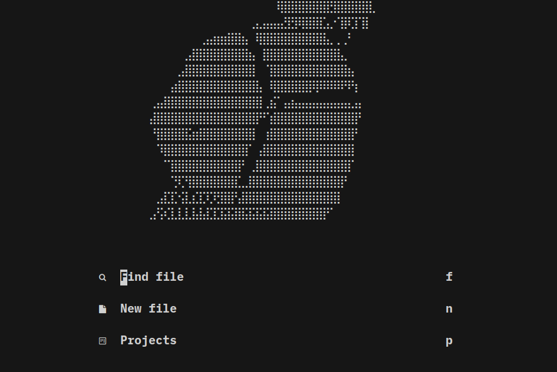

# .dotfiles

## lazyvim

### lazyvim show case




### lazyvim standalone install

```bash
curl -L https://raw.githubusercontent.com/konosubakonoakua/.dotfiles/main/scripts/install/lazyvim.conf.sh | sh
```

### misc
- https://www.conventionalcommits.org/zh-hans/v1.0.0/
- http://mywiki.wooledge.org/BashPitfalls
- https://github.com/awesome-lists/awesome-bash
